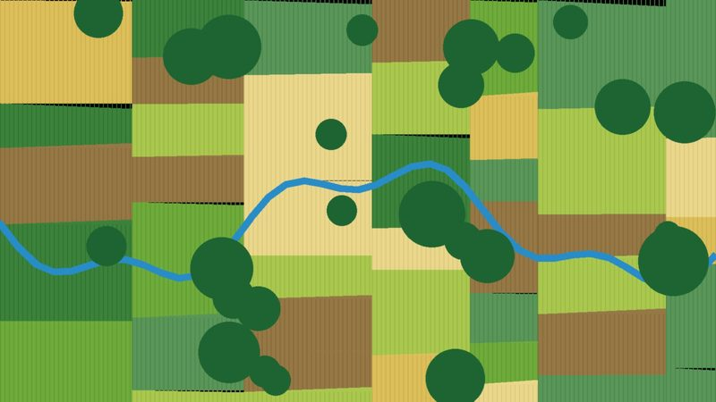
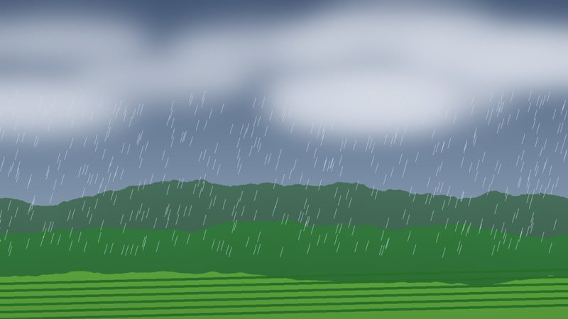
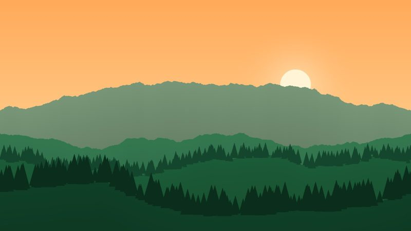
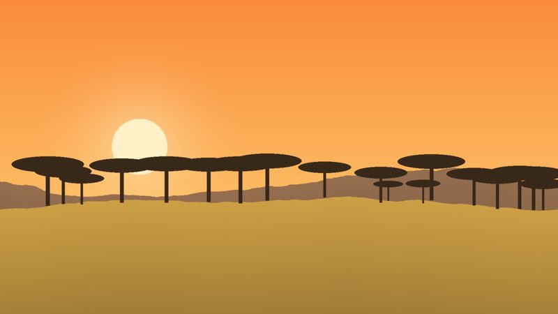
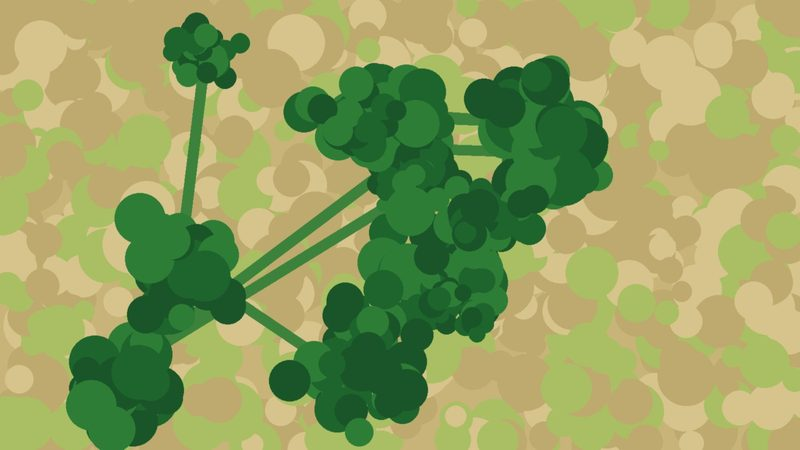
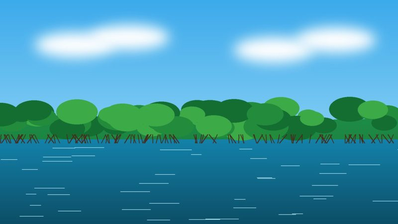

```{=html}
<style>
  /* Home page only: navbar floats over the hero slideshow */
    #quarto-content, main.content { padding-top: 0 !important; margin-top: 0 !important; }
  body { padding-top: 0 !important; }
  .hero { margin-top: -16px !important; }
  main.content > *:first-child { margin-top: 0; }
</style>
```

::: {.hero .column-screen}
<div class="slide" style="background-image: url(images/placeholders/forest.jpg);"></div>
<div class="slide" style="background-image: url(images/placeholders/savanna.jpg);"></div>
<div class="slide" style="background-image: url(images/placeholders/farmland.jpg);"></div>
<div class="slide" style="background-image: url(images/placeholders/mangrove.jpg);"></div>
<div class="slide" style="background-image: url(images/placeholders/highlands.jpg);"></div>
<div class="overlay"></div>
<div class="hero-content">
<div class="slogan">Mapping change.<br><span class="y">Modeling futures.</span><br><span class="g">Building resilient landscapes.</span></div>
<p class="lede">I use geospatial science to understand how land use, governance, and a changing climate reshape landscapes, and to find pathways that help people and ecosystems adapt and thrive.</p>
<div><a class="btn-solid" href="research.html">Explore my research</a><a class="btn-outline" href="publications.html">Publications</a></div>
</div>
<div class="dots"><i></i><i></i><i></i><i></i><i></i></div>
:::

::: {.column-page}

::: {.about}
::: {.id-card}
{.profile fig-alt="Portrait of Susan Kotikot"}

[Susan Malaso Kotikot, PhD]{.who}

[Assistant Research Professor]{.role}

[Department of Geography, Sustainability, Community & Urban Studies<br>University of Connecticut]{.dept}

<div class="socials"><a href="mailto:susan.kotikot@uconn.edu" aria-label="Email"><i class="bi bi-envelope-fill"></i></a><a href="https://www.linkedin.com/in/susankotikot" aria-label="LinkedIn"><i class="bi bi-linkedin"></i></a><a href="https://github.com/skotikot" aria-label="GitHub"><i class="bi bi-github"></i></a><a href="https://scholar.google.com/citations?user=GiHpEEsAAAAJ&amp;hl=en" aria-label="Google Scholar"><i class="bi bi-mortarboard-fill"></i></a></div>
:::

::: {}
[About <span>me</span>]{.section-tab}

I am a geographer and landscape ecologist who studies how land-use decisions, governance, and environmental change shape the ability of social-ecological systems to adapt and thrive. My work brings together landscape ecology, remote sensing, GIS, spatial modeling, and the knowledge of the people who live on and manage the land, with the aim of identifying land-use pathways that support climate adaptation, resilience, and regenerative landscape futures.

Much of my research is rooted in the agropastoral landscapes of East Africa, where I examine how historical land policies, rainfall variability, and competing land uses reorganize landscape structure over time. I have also worked on coastal mangrove systems in the Caribbean and Central America, and on climate and infrastructure questions in the United States. Across these settings, I try to produce knowledge and tools that planners, land managers, and policymakers can put to use.

I hold a PhD in Geography and Climate Science from Penn State (2023), an MS in Earth System Science from the University of Alabama in Huntsville, and a BS in Environmental Planning and Management from Kenyatta University. Before joining UConn, I was a postdoctoral scholar with Penn State's Earth and Environmental Systems Institute and the Smithsonian Environmental Research Center, and earlier a research associate at Oak Ridge National Laboratory.

<span class="pill">AGU</span><span class="pill">ESA</span><span class="pill">IALE</span>
:::
:::

[Research <span>Interests</span>]{.section-tab}

```{=html}
<div class="ri-grid">
  <div class="ri-card"><div class="ri-img"></div>
    <div class="ri-title">Land-Use &amp; Land-Cover Change</div>
    <div class="ri-body">Mapping how landscapes change, and why, using satellite and historical aerial imagery.</div></div>
  <div class="ri-card"><div class="ri-img"></div>
    <div class="ri-title">Climate Variability &amp; Impacts</div>
    <div class="ri-body">Characterizing rainfall variability, drought, and climate risks to agricultural systems.</div></div>
  <div class="ri-card"><div class="ri-img"></div>
    <div class="ri-title">Landscape Ecology</div>
    <div class="ri-body">Pattern–process relationships, fragmentation, connectivity, and landscape heterogeneity.</div></div>
  <div class="ri-card"><div class="ri-img"></div>
    <div class="ri-title">Social-Ecological Resilience</div>
    <div class="ri-body">How policy, governance, and land users' experiences shape adaptive capacity.</div></div>
  <div class="ri-card"><div class="ri-img"></div>
    <div class="ri-title">Land-Use Modeling &amp; Scenarios</div>
    <div class="ri-body">Simulating future landscapes under alternative policy, management, and climate pathways.</div></div>
  <div class="ri-card"><div class="ri-img"></div>
    <div class="ri-title">Decision Support</div>
    <div class="ri-body">Open, reproducible geospatial tools for land and ecosystem managers.</div></div>
</div>
```

:::
