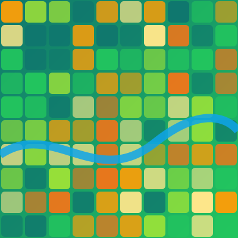
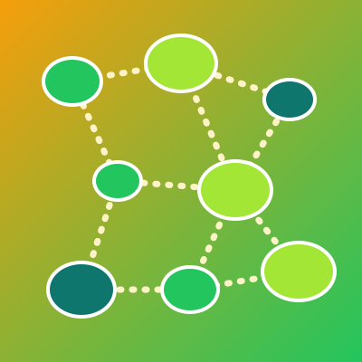
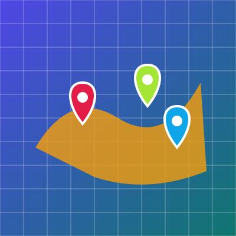

I study the ways multifunctional landscapes (places that simultaneously support livelihoods, biodiversity, and ecosystem services) are reorganized by interactions among climate variability, disturbance, and human activity. My work combines multi-scale remote sensing, GIScience, spatial statistics, land-use modeling, and mixed methods, and is organized around three connected themes. **Click an image to read more about each topic.**

::: {.theme-block .theme-1}
## Mapping spatiotemporal patterns of dynamic landscapes

I map and analyze change in land use, land cover, and climate across space and time to understand how landscapes are changing, what drives those changes, and where impacts are felt most.

::: {.topic-grid}
::: {.topic}
[{fig-alt="Land-use and land-cover change"}](research/land-change.qmd)
[Land-use & land-cover change]{.topic-name} [Policy legacies and landscape structure]{.topic-sub}
:::

::: {.topic}
[{fig-alt="Rainfall variability and drought"}](research/rainfall.qmd)
[Rainfall variability & drought]{.topic-name} [Climate patterns across scales]{.topic-sub}
:::

::: {.topic}
[{fig-alt="Climate risks to agriculture"}](research/agri-risk.qmd)
[Climate risks to agriculture]{.topic-name} [Frost and extreme-weather mapping]{.topic-sub}
:::
:::
:::

::: {.theme-block .theme-2}
## Modeling integrated landscapes for social-ecological resilience

Land-use legacies can shape ecosystems for decades and spill over into other places. I combine social and biophysical data with spatially explicit models to understand the drivers and consequences of land use, and to explore futures under alternative policies and climates.

::: {.topic-grid}
::: {.topic}
[{fig-alt="Land users' perceptions of climate change"}](research/perceptions.qmd)
[Land users' perceptions]{.topic-name} [Lived experience of environmental change]{.topic-sub}
:::

::: {.topic}
[{fig-alt="Land-use simulation and scenarios"}](research/scenarios.qmd)
[Land-use simulation & scenarios]{.topic-name} [Modeling future landscapes]{.topic-sub}
:::

::: {.topic}
[{fig-alt="Regenerative landscape design"}](research/regenerative.qmd)
[Regenerative landscape design]{.topic-name} [Heterogeneity, connectivity & recovery]{.topic-sub}
:::
:::
:::

::: {.theme-block .theme-3}
## Transdisciplinary research for landscape management

A central goal of my work is to support adaptive, data-driven management. I work with stakeholders to build decision-support tools and evidence that managers and policymakers can use to monitor change and prioritize action.

::: {.topic-grid}
::: {.topic}
[{fig-alt="Mangrove monitoring"}](research/mangroves.qmd)
[Mangrove monitoring]{.topic-name} [Decision support for coastal managers]{.topic-sub}
:::

::: {.topic}
[{fig-alt="Protected areas and human wellbeing"}](research/protected-areas.qmd)
[Protected areas & wellbeing]{.topic-name} [Conservation outcomes for people]{.topic-sub}
:::

::: {.topic}
[{fig-alt="Geospatial decision analysis"}](research/decision-support.qmd)
[Geospatial decision analysis]{.topic-name} [Siting and planning under climate change]{.topic-sub}
:::
:::
:::

## Where my research is heading

Building on this foundation, my future work asks how, and at what scales, climate change alters pattern–process interactions in landscapes, and how compound disturbances and spatially uneven stresses push ecosystems onto new trajectories. I am especially interested in moving beyond "bouncing back" to ask how landscapes can be deliberately designed toward more desirable states, by strengthening heterogeneity, connectivity, and regenerative capacity, and by matching resource management to ecosystem dynamics.

## Funding

My research has been supported by the National Science Foundation (Human-Environment and Geographical Sciences program), a National Geographic Society Early Career Grant, the Miller Graduate Student Fellowship, and several internal awards from Penn State.
