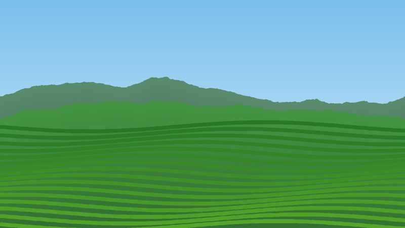
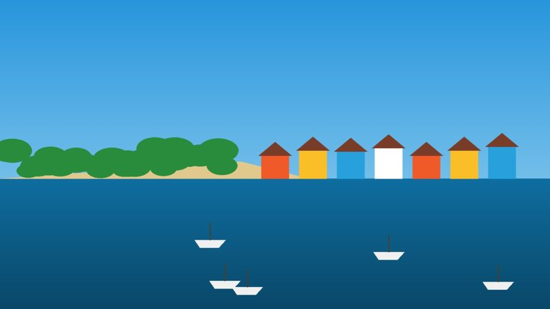
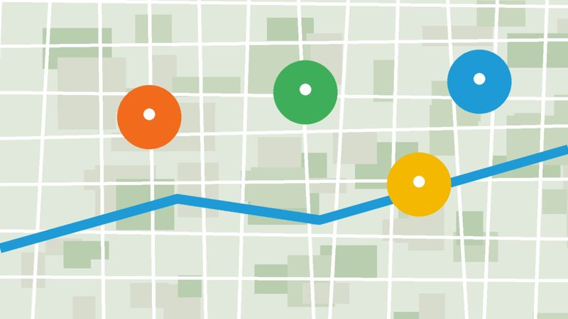

I study the ways multifunctional landscapes (places that simultaneously support livelihoods, biodiversity, and ecosystem services) are reorganized by interactions among climate variability, disturbance, and human activity. My work combines multi-scale remote sensing, GIScience, spatial statistics, land-use modeling, and mixed methods, and is organized around three connected themes. **Select VIEW on any card to read more about the related studies.**

::: {.theme-block .theme-1 .column-page}
## Mapping spatiotemporal patterns of dynamic landscapes

I map and analyze change in land use, land cover, and climate across space and time to understand how landscapes are changing, what drives those changes, and where impacts are felt most.

```{=html}
<div class="ri-grid">
  <div class="ri-card"><a class="ri-img" href="research/land-change.html"></a>
    <div class="ri-title">Land-Use &amp; Land-Cover Change</div>
    <div class="ri-body"><p>How historical land policies and competing land uses reshape landscape structure in East Africa.</p><a class="btn-view" href="research/land-change.html">View</a></div></div>
  <div class="ri-card"><a class="ri-img" href="research/rainfall.html"></a>
    <div class="ri-title">Rainfall Variability &amp; Drought</div>
    <div class="ri-body"><p>Characterizing rainfall variability and drought across scales in Kenya and the United States.</p><a class="btn-view" href="research/rainfall.html">View</a></div></div>
  <div class="ri-card"><a class="ri-img" href="research/agri-risk.html"></a>
    <div class="ri-title">Climate Risks to Agriculture</div>
    <div class="ri-body"><p>Mapping frost and extreme-weather threats to farming systems using Earth observation.</p><a class="btn-view" href="research/agri-risk.html">View</a></div></div>
</div>
```
:::

::: {.theme-block .theme-2 .column-page}
## Modeling integrated landscapes for social-ecological resilience

Land-use legacies can shape ecosystems for decades and spill over into other places. I combine social and biophysical data with spatially explicit models to understand the drivers and consequences of land use, and to explore futures under alternative policies and climates.

```{=html}
<div class="ri-grid">
  <div class="ri-card"><a class="ri-img" href="research/perceptions.html"></a>
    <div class="ri-title">Land Users' Perceptions</div>
    <div class="ri-body"><p>How farmers and pastoralists experience changes in rainfall and productivity, and why it matters.</p><a class="btn-view" href="research/perceptions.html">View</a></div></div>
  <div class="ri-card"><a class="ri-img" href="research/scenarios.html"></a>
    <div class="ri-title">Land-Use Simulation &amp; Scenarios</div>
    <div class="ri-body"><p>Modeling multifunctional landscapes under alternative policy, management, and climate futures.</p><a class="btn-view" href="research/scenarios.html">View</a></div></div>
  <div class="ri-card"><a class="ri-img" href="research/regenerative.html"></a>
    <div class="ri-title">Regenerative Landscape Design</div>
    <div class="ri-body"><p>Using heterogeneity and connectivity to design landscapes that do more than bounce back.</p><a class="btn-view" href="research/regenerative.html">View</a></div></div>
</div>
```
:::

::: {.theme-block .theme-3 .column-page}
## Transdisciplinary research for landscape management

A central goal of my work is to support adaptive, data-driven management. I work with stakeholders to build decision-support tools and evidence that managers and policymakers can use to monitor change and prioritize action.

```{=html}
<div class="ri-grid">
  <div class="ri-card"><a class="ri-img" href="research/mangroves.html"></a>
    <div class="ri-title">Mangrove Monitoring</div>
    <div class="ri-body"><p>An open Earth Engine tool that helps coastal managers track mangrove loss, gain, and recovery.</p><a class="btn-view" href="research/mangroves.html">View</a></div></div>
  <div class="ri-card"><a class="ri-img" href="research/protected-areas.html"></a>
    <div class="ri-title">Protected Areas &amp; Wellbeing</div>
    <div class="ri-body"><p>Linking mangrove protected areas to ecosystem health and the wellbeing of coastal communities.</p><a class="btn-view" href="research/protected-areas.html">View</a></div></div>
  <div class="ri-card"><a class="ri-img" href="research/decision-support.html"></a>
    <div class="ri-title">Geospatial Decision Analysis</div>
    <div class="ri-body"><p>Siting and planning critical infrastructure under a changing climate.</p><a class="btn-view" href="research/decision-support.html">View</a></div></div>
</div>
```
:::

## Where my research is heading

Building on this foundation, my future work asks how, and at what scales, climate change alters pattern–process interactions in landscapes, and how compound disturbances and spatially uneven stresses push ecosystems onto new trajectories. I am especially interested in moving beyond "bouncing back" to ask how landscapes can be deliberately designed toward more desirable states, by strengthening heterogeneity, connectivity, and regenerative capacity, and by matching resource management to ecosystem dynamics.

## Funding

My research has been supported by the National Science Foundation (Human-Environment and Geographical Sciences program), a National Geographic Society Early Career Grant, the Miller Graduate Student Fellowship, and several internal awards from Penn State.
