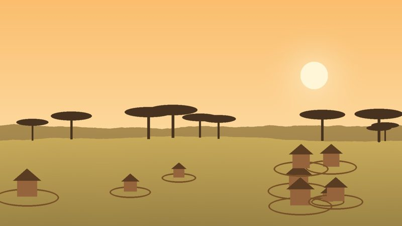

::: {.topic-banner}

::: {}
[Theme 2 · Modeling integrated landscapes]{.theme-tag .tag-2}

Farmers and pastoralists experience climate change through their fields, herds, and livelihoods. Their perceptions embody local and Indigenous knowledge and shape how they respond, which makes them essential for designing locally relevant adaptation.
:::
:::

Working with colleagues at Maasai Mara University, I studied how agropastoral land users in southern Kenya perceive changes in rainfall and in crop and pasture productivity, and how these perceptions compare with observed data.

## Key insights

- Perceptions varied widely among land users, signaling that climate impacts are felt differently across households and livelihoods.
- Perceptions did not always match observed climate and environmental data, yet they reflected real impacts on local livelihoods.
- Incorporating human dimensions is critical for landscape-scale modeling and management.

## Methods & tools

Household surveys · remotely sensed rainfall and vegetation productivity · ordination analysis · mixed methods · R

## Related publications

- **Kotikot, S.M.**, Smithwick, E.A.H., Nankaya, J., Gergel, S., Zimmerer, K., & Abila, R. (2025). Heterogeneous perceptions of rainfall patterns among agropastoral land users in Sub-Saharan Africa. *Annals of the American Association of Geographers*, 1–23. [DOI](https://doi.org/10.1080/24694452.2025.2482899){.badge-doi}

## Code

- [Perceptions-of-Environmental-Change](https://github.com/skotikot/Perceptions-of-Environmental-Change): Replication code linking survey data with multi-temporal remote sensing

[← Back to Research](../research.qmd){.back-link}
